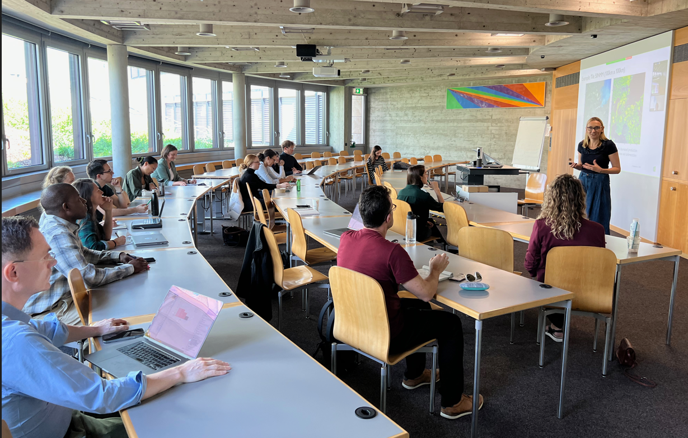

Dear members of the HSG Impact Scholar Community,

we hope you are doing well and you had a great summer break.

We would like to highlight some new development to you.

**PhD course on Ethics, Responsibility & Sustainability**
An exciting new course has been created on what Ethics, Responsibility & Sustainability (ERS) mean for your research. It is now accessible to all PMA students through the bidding system. Don't miss out this great opportunity to become familiar with the notions of ERS and be able to apply them to each stage of your own PhD journey and throughout your academic career in order to produce valuable, rigorous and high quality research. The class is co-taught by Karim Bschir, Judith Walls, Antoinette Weibel and Florian Wettstein.
All the professors can't wait to share their expertise on these topics with you on December 1st , 2nd and 3rd with an additional nice exchange planned on the 2nd evening for all its participants.
More information [here](https://tools.unisg.ch/handlers/Public/CourseInformationSheet.ashx/semester/HS22/eventnumber/10,161,1.00.pdf). 

**NextGen Sustainability Mentoring: Doctoral are candidates welcome to apply**
[The NextGen Mentoring track](https://sustainability.unisg.ch/nextgen-sustainability-mentoring/#landing) is connecting impact-driven HSG students with a cohort of sustainability professionals within the HSG Mentoring Programme. It aims to accelerate the informal transfer of knowledge, relationship building, critical thinking and professional excellence to tackle the most pressing sustainability challenges. Within the 2022-24 cohort we welcome 30+ sustainability-driven mentors from companies like Axpo, Deloitte, Helion, Implement Consulting Group, Muntagnard, Nestlé, Novartis, Ongresso Energy, Radicant, Roche, UBS and Xilva, and others. If this resonates with you, feel free to sign up as a mentee between Sep. 12 and Oct. 3 via the [HSG Mentoring platform.](https://coaching-mentoring.unisg.ch/mentee)

**Review past event: Impact Exchange on Social Sustainability**
On September 1st, Prof. Jamie Gloor and her team hosted the Impact Scholar Community for a research exchange. We listened to seven inspiring research pitches and had fruitful discussions. It was a valuable, enriching opportunity to connect across centers, institutes, and faculties on social sustainability. Thanks again to all participants and presenters and a special thanks to Jamie and Eugenia for co-organizing the event. 

If you are interested in hosting the community for a workshop or if you would like to co-create another event, please reach out to us! 

All the best and warm regards,

Tabea and Tobias for the HSG Impact Scholar Community